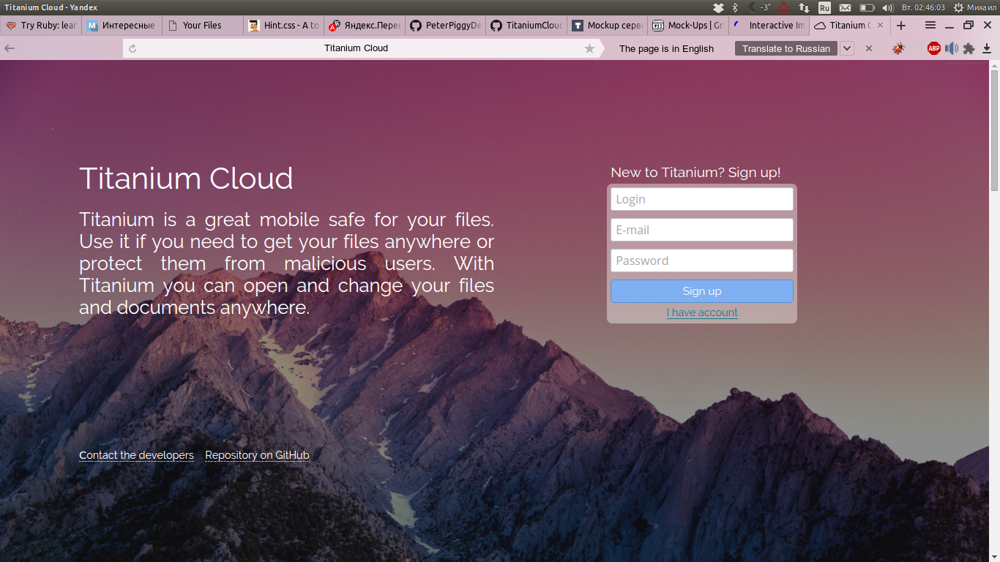

# TitaniumCloud
##Introduction
It's a cloud of titanium.

##Description
It is a cloud and a web client, which allow you to locate files on the server. It has a test account named 'namename' with password 'passpass' with test files to provide less effort test.

This is my list of wishes, which came to my mind when I have just thought about realization.

|Realized|*HASKELL SERVER*|
|----|----|
|\|/ |registration and authentication form|
|\|/ |create command "find <username>" for server|
|\|/ |file delete, rename and remove|
|\|/ |add password checking for server|
|\|/ |visitor statistics by names of registered users and by requests of not registeredusers|
|\|/ |cookies support|
|\|/ |create database for users|
|\|/ |prevent from '/.' and '..' queries|
|FAILED |increase requests processing speed|
|FAILED |prevent from hacker attacks|

|Realized|*HTML/JAVASCRIPT*|
|----|----|
|\|/ |files download|
|\|/ |files upload|
|\|/ |files delete, rename and remove|
|\|/ |registration and authentication form|
|\|/ |add ajax support for site|
|\|/ |add click statistic map on "CTRL+." press on each page|
|\|/ |add dynamically loaded files browsing for site|
|\|/ |snake game on 404 (Not Found) page|

##Make and launch
If you want to launch server, you should make the project. 
To make it you should install **Glassgow Haskell Compiler**, **Cabal** and **Make**. Then '**cd**' to your clone directory, install all cabal project dependencies and run '**make**'. Server will be made and run.

Then you can open **localhost:8888** and it will cause connect to the server.
